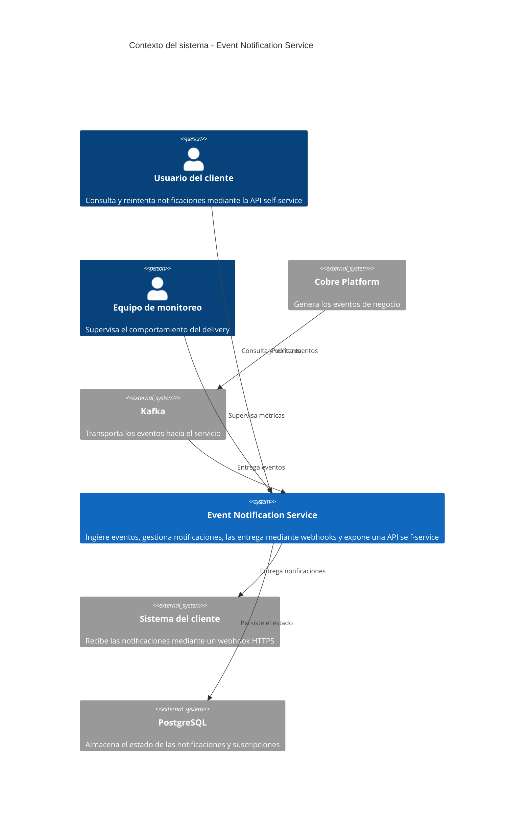
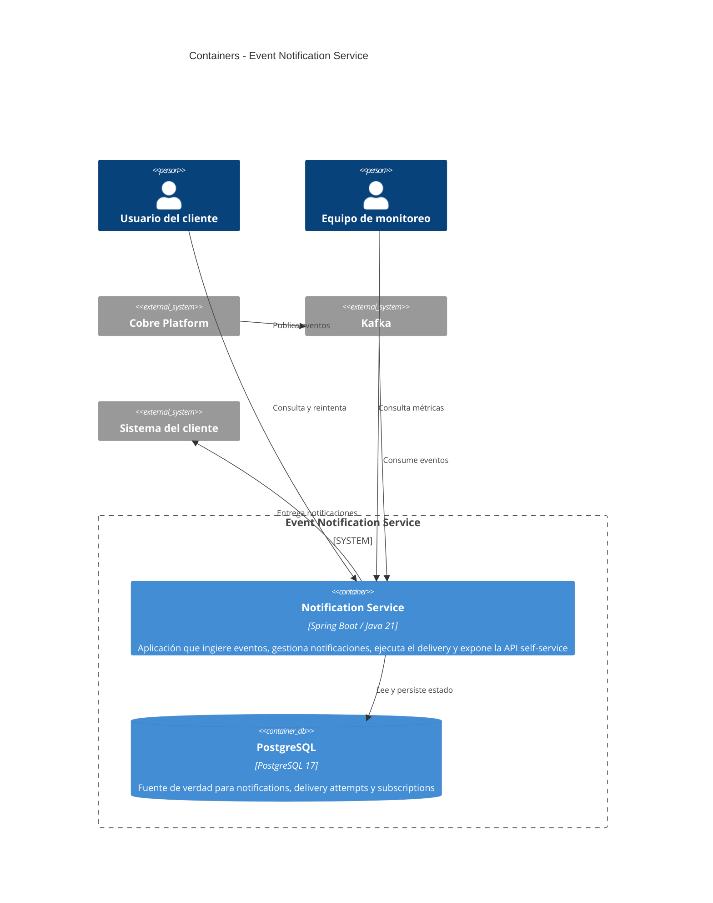
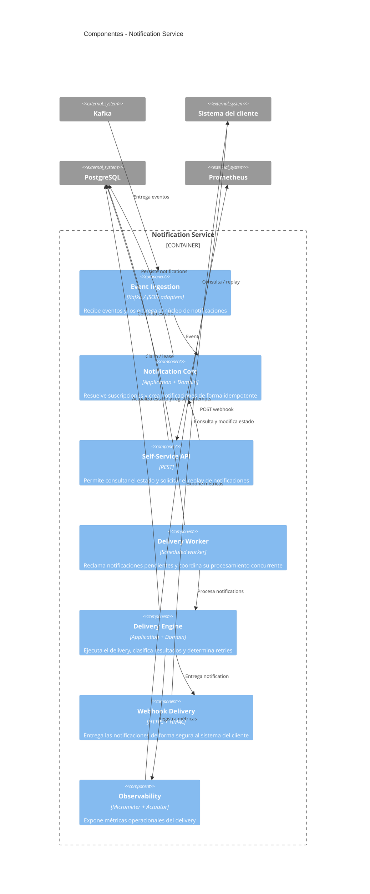

# Diagramas C4 de arquitectura

Este documento presenta las principales vistas arquitectónicas del **Event Notification Service**, siguiendo el modelo C4 y complementándolo con dos diagramas de secuencia para explicar los flujos de comportamiento más relevantes.

Cada diagrama responde una pregunta diferente y aumenta progresivamente el nivel de detalle, desde el contexto general del sistema hasta su comportamiento interno bajo concurrencia y fallos.

| Vista                                     | Nivel | Qué permite entender |
|-------------------------------------------|---|---|
| **1. Contexto**                           | C4 - Context | El propósito del sistema y sus principales actores y dependencias externas |
| **2. Contenedores**                       | C4 - Container | Las unidades ejecutables que componen el sistema y sus principales interacciones |
| **3. Componentes**                        | C4 - Component | Las responsabilidades principales dentro de la aplicación |
| **4. Flujo de entrega: evento → webhook** | Secuencia | El recorrido de un evento desde su ingestión hasta la entrega al webhook del cliente |
| **5. Concurrencia y reintentos**          | Secuencia | Cómo se evita el procesamiento duplicado y cómo se recupera el trabajo ante fallos |

> **Nota:** Los tres primeros diagramas corresponden a los niveles Context, Container y Component del modelo C4. Los dos últimos son diagramas de secuencia complementarios y se utilizan para explicar comportamientos que no se representan adecuadamente mediante una vista estática.

Los diagramas de secuencia se encuentran en archivos independientes para mantenerlos legibles y facilitar su uso tanto en la documentación como en la presentación:

- [Flujo de entrega de eventos](./sequence-event-to-delivery.md)
- [Concurrencia y reintentos](./sequence-retry-and-concurrency.md)

Para conocer el razonamiento detrás de las principales decisiones de arquitectura, consultar los [ADRs](../decisions/).
## 1. C4 Context

### ¿Qué comunica esta vista?

Esta vista establece los límites del sistema y muestra las principales interacciones con actores y sistemas externos. El servicio recibe eventos desde la plataforma de origen mediante Kafka, persiste su estado en PostgreSQL y entrega las notificaciones al sistema del cliente mediante webhooks HTTPS.

También muestra la interfaz self-service utilizada por los usuarios de los clientes y la superficie de observabilidad utilizada por el equipo de monitoreo.

## 2. C4 Container

### ¿Qué comunica esta vista?

El sistema se despliega como una única aplicación Spring Boot respaldada por PostgreSQL. La aplicación concentra la ingestión de eventos, la API self-service y el procesamiento asíncrono del delivery.

Kafka y los endpoints webhook de los clientes son dependencias externas. Esta vista no descompone la aplicación internamente; ese nivel de detalle corresponde al diagrama de componentes.

## 3. C4 Component

### ¿Qué comunica esta vista?

Esta vista descompone la aplicación Spring Boot en sus principales responsabilidades internas, sin llegar al nivel de cada clase o implementación.

El flujo principal comienza en la ingestión de eventos y continúa hacia el núcleo de notificaciones. El Delivery Worker reclama el trabajo pendiente y lo entrega al Delivery Engine, que coordina el resultado del intento, los reintentos y la entrega mediante el Webhook Delivery.

La observabilidad se mantiene como una responsabilidad transversal que permite exponer métricas operacionales sin formar parte del flujo funcional de delivery.