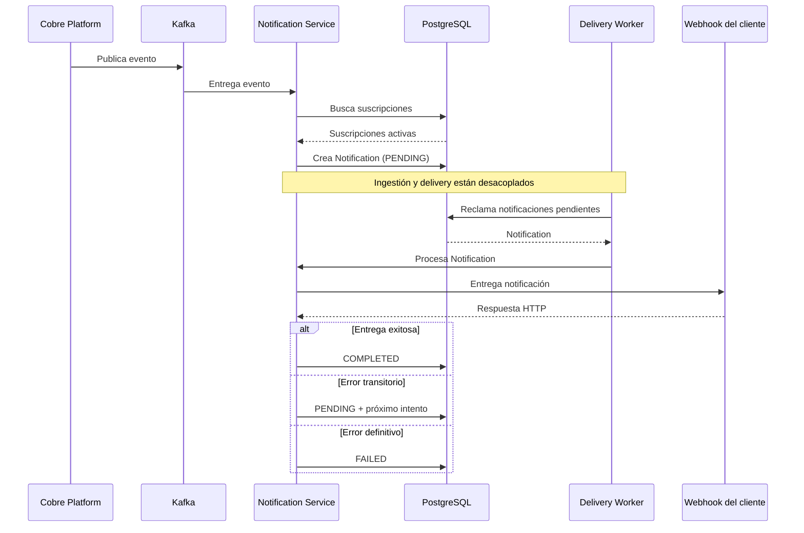

# Flujo de entrega: evento → webhook

Este diagrama muestra el flujo temporal principal del sistema, desde la publicación de un evento hasta el resultado de su entrega al webhook del cliente.

A diferencia de las vistas C4, que describen la estructura del sistema, esta vista se centra en **qué ocurre y en qué orden**. También hace explícita una decisión fundamental de la arquitectura: la ingestión del evento y su posterior delivery están desacoplados.

## Flujo principal

### ¿Qué comunica esta vista?

El flujo muestra cómo un evento atraviesa el sistema desde su publicación hasta la entrega al webhook del cliente.

La ingestión y el delivery están desacoplados: la creación de la `Notification` ocurre al consumir el evento, mientras que su entrega es realizada posteriormente por el Delivery Worker.

El resultado del intento determina el siguiente estado de la notificación:

- **COMPLETED:** la entrega fue exitosa.
- **PENDING:** el error es transitorio y se programa un nuevo intento.
- **FAILED:** la entrega no puede continuar o se agotaron los intentos permitidos.

### Decisiones relevantes

- La creación de la `Notification` es idempotente, evitando duplicados ante el reprocesamiento de un evento.
- El Delivery Worker procesa las notificaciones de forma independiente al proceso de ingestión.
- La concurrencia, los leases y el fencing se explican con mayor detalle en el diagrama **Concurrencia y reintentos**.