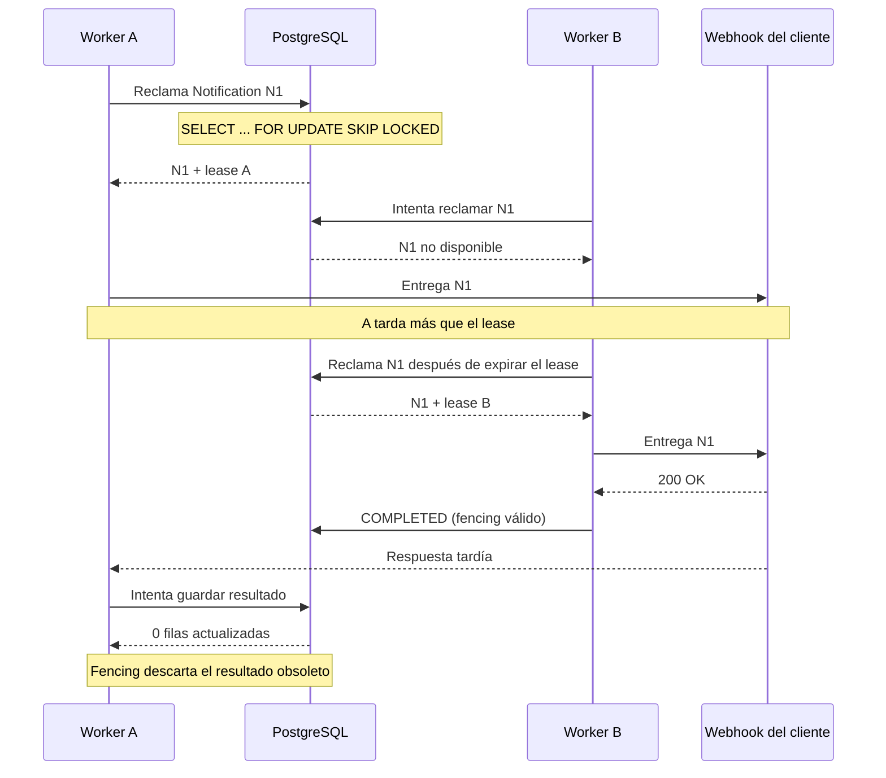

# Concurrencia y reintentos

Este diagrama muestra cómo el sistema coordina múltiples workers sobre una misma notificación y cómo recupera el trabajo cuando un worker deja de responder durante su procesamiento.

La vista se centra en tres mecanismos: **claim con concurrencia segura, leases para recuperar trabajo abandonado y fencing para evitar que un worker antiguo sobrescriba el resultado de un worker que tomó posteriormente la notificación**.

### ¿Qué comunica esta vista?

El sistema utiliza un mecanismo de **claim + lease** para distribuir las notificaciones entre múltiples workers sin que dos workers procesen simultáneamente la misma notificación.

El `lease` también permite recuperar una notificación cuando el worker que la reclamó deja de responder o permanece procesándola durante más tiempo del permitido.

El mecanismo de **fencing** protege contra respuestas tardías: si un segundo worker recupera la notificación después de expirar el lease del primero, cualquier actualización posterior del worker original es rechazada.

### Decisiones relevantes

- **SKIP LOCKED:** evita que varios workers bloqueados sobre el mismo conjunto de filas reclamen simultáneamente el mismo trabajo.
- **Lease:** permite que otro worker recupere una notificación cuyo procesamiento quedó abandonado.
- **Fencing:** evita que el propietario anterior sobrescriba el estado después de que otro worker haya tomado la notificación.
- **Retry con backoff:** los errores transitorios vuelven a `PENDING` y se programa el siguiente intento sin bloquear el procesamiento de otras notificaciones.